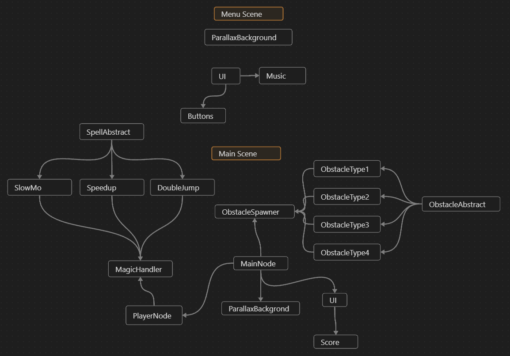

# Magic platformer

## Description

This game combines endless platformer with unpredictable magic. The player is trying to survive as long as possible, jumping to falling blocks and avoiding obstacles. The player can move with jumping, he can stick to object's walls and can dash even through objects, if they are small enough. The player can also use his special ability, which can cast a spell. The spell is random and can be either good or bad.

## TODO

- [x] Plan the mechanics (Hour 1)
- [x] Create diagram of nodes and scenes (Hour 1.5)
- [x] Create the player (Hour 2)
- [x] Create demo level (Hour 2.5)
- [x] Create obstacles spawning
- [ ] Add projectiles
- [ ] Add Dangerous Obstacles
- [ ] Add Object Spawnings
- [ ] Implement StickToWall
- [x] Implement Dash (Hour 3)
- [ ] Implement Spell
- [x] Implement obstacles falling from the sky (Hour 4)
- [x] Add menu (Hour 2)
- [ ] Add sounds
- [x] Add music
- [ ] Add animations
- [ ] Add custom assets
- [ ] Polish and deploy

## Diagram of Nodes and Scenes
